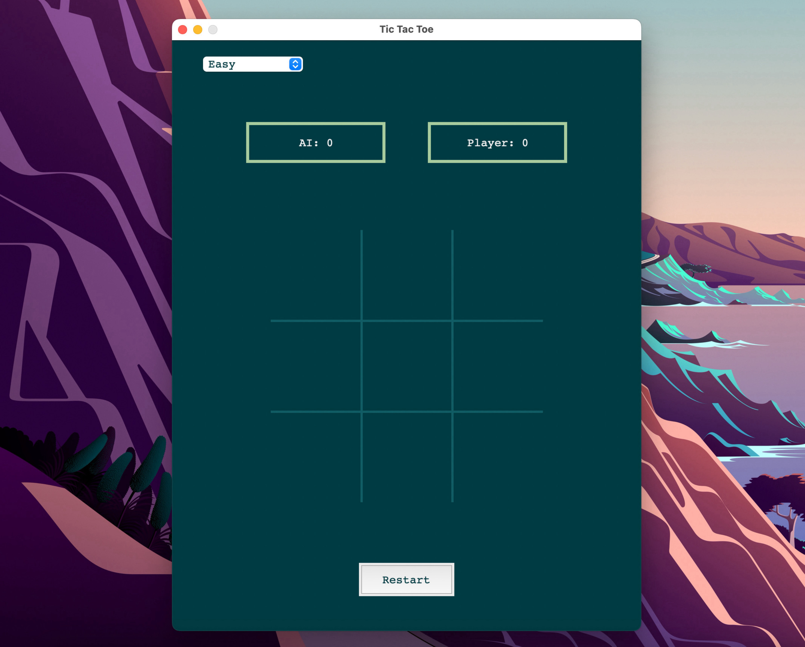
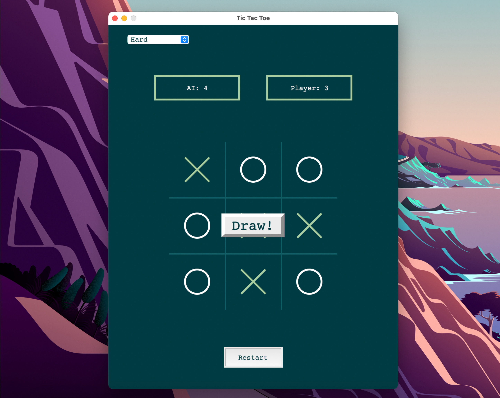

## Tic-Tac-Toe

A graphical Tic-Tac-Toe game implemented using Python's Tkinter for the user interface and custom game logic, featuring multiple difficulty levels for AI opponents. Play against an AI that gets smarter as you increase the difficulty from Easy to Pain, with animated graphics and a score-tracking system.

## Features

- **Multiple Difficulty Levels:**

  - **Easy:** AI makes random moves, providing a more casual experience.
  - **Hard:** AI evaluates board positions and makes strategic choices, favoring winning moves and blocking the player.
  - **Pain:** AI utilizes the Minimax algorithm to assess all possible game outcomes, ensuring the best possible move is made at every turn.

- **Scoreboard:** Tracks player and AI scores.

- **Animated Moves:** 'X' and 'O' are drawn with animations for a better visual experience.

- **Winning Line Animation:** Highlights the winning line when a player wins.

## How to Play

1. Run `main.py` to start the game.
2. Select the difficulty level from the dropdown menu.
3. Click on a cell in the game board to place your move. The AI will automatically make its move afterward.
4. The game ends when someone wins or when the board is full.
5. Click ```Restart``` to start a new game and keep your scores.

## Visuals
<table>
<tr>
<td></td>
<td></td>
</tr>
<tr>
<td></td>
</tr>
</table>

## License

This project is open-source and available under the MIT License.

## Author

**Kobby S. Arthur**
